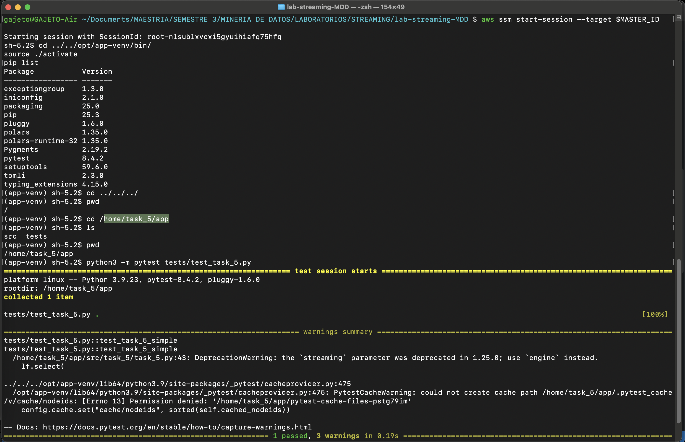

# POLARS LAZYFRAME PARA STREAMING

En esta tarea el objetivo era implementar una operación simple de streaming utilizando el LazyFrame de Polars.

## Instrucciones

### Preparación
Lo primero es referenciar el bucket S3 que alojará los scripts para hacer pruebas de funcionamiento. Este bucket será creado junto a la instancia EC2 y se llamará *s3://data-task-5/*

Para evitar conflictos por reejeuciones de esta tarea, se puede limpiar el folder en el bucket.
```bash
aws s3 rm s3:///data-task-5/ --recursive
```

Ahora ya se puede crear la instancia con una configuración terraform. Ubicarse en la raiz del folder */ec2-python-polars* y aplicar los siguientes comandos:
```bash
terraform init
terraform plan
terraform apply
```

Al finalizar la configuración se muestran algunos datos de la instancia creada. Se debe copiar la salida de **instance_ID** para acceder a la misma mediante SSM.

 

**Después de terminar la validación**, ejecutar el comando  `terraform destroy` para eliminar todos los recursos creados y no generar costos adicionales.

## Prueba en EC2
Lo siguiente es comprimir los scripts y llevarlos a S3 para que puedan ser homologados en el sistema de archivos de la instancia. Ubicarse en la raíz del repo e ingresar los siguientes comandos:

Comprimir en .tar
```bash
tar -czf app.tar.gz src tests || true
```

Cargar .tar en bucket S3
```bash
aws s3 cp app.tar.gz s3://data-task-5/app.tar.gz
```

Setear ID de la instancia EC2
```bash
INSTANCE_ID=i-0dbe7b6a7155db69d
```

Luego, se debe descomprimir el .tar homologado en sistema de archivos de la instancia. Se hace antes de iniciar sesión SSM propiamente, para evitar mucha manualidad en el acceso a rutas.

```bash
aws ssm send-command \
  --instance-ids "$INSTANCE_ID" \
  --document-name "AWS-RunShellScript" \
  --comment "Fetch app and unpack" \
  --parameters commands='[
    "set -euo pipefail",
    "mkdir -p /home/task_5/app",
    "aws s3 cp s3://data-task-5/app.tar.gz /home/task_5/",
    "tar -xzf /home/task_5/app.tar.gz -C /home/task_5/app"
  ]' \
  --output-s3-bucket-name data-task-5 \
  --output-s3-key-prefix ssm-logs/run-unpack
```


Ahora si se procede a iniciar la conexión a la instancia , especificando el argumento target con el valor copiado de **instance_ID** (INSTANCE_ID ya definido):
```bash
aws ssm start-session --target $INSTANCE_ID
```

Para proceder a ejecutar el test se debe activar el ambiente virtual con polars y pytest instalado:
```bash
cd ../../opt/app-venv/bin/
source ./activate
pip list
```

Luego dirigirse a donde se homologaron los scripts
```bash
cd ../../../home/task_5/app
```

Y ya finalmente se puede ejecutar el test
```bash
python3 -m pytest tests/test_task_5.py
```


