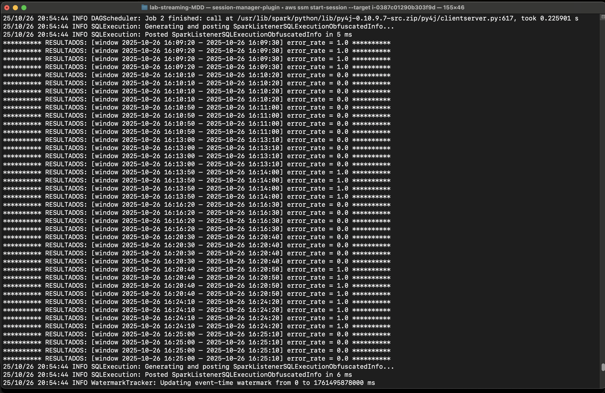

# WINDOW OPERATIONS WITH DISTRIBUITED SPARK (EMR)

En esta tarea el objetivo era configurar una rutina Spark para aplicar operaciones de ventana en un stream de logs. Para lograrlo se hace necesario llevar los archivos locales al nodo maestro del cluster EMR y allí lanzar una tarea Yarn para la ejecución del cómputo distribuido.

## Instrucciones

### Preparación

Lo primero es referenciar el bucket S3 que contiene los logs para simular el streaming. Si aún no se ha creado,ubicarse en la raíz del repo y enviar:
```bash
python scripts/generator.py test-data-streaming-mdd --is-bucket --num-files 10 --events-per-batch 1000
```
Este bucket es necesario pues en el mismo se creará un folder de *checkpoints/* necesario para guardar resultados intermedios durante la ejecución en EMR.
Para evitar conflictos por reejeuciones de esta tarea, se puede limpiar el folder en el bucket.
```bash
aws s3 rm s3://test-data-streaming-mdd/checkpoints/ --recursive
```
Con el bucket, ya se puede crear el cluster EMR con una configuración terraform. Ubicarse en la raiz del folser */emr-cluster* y aplicar los siguientes comandos:
```bash
terraform init
terraform plan
terraform apply
```

Al finalizar la configuración se muestran algunos datos de la instancia creada. Se debe copiar la salida de **emr_master_node_instance_id** para acceder al nodo maestro mediante SSM.

 

**Después de terminar la validación**, ejecutar el comando  `terraform destroy` para eliminar todos los recursos creados y no generar costos adicionales.

### Cómputo distribuido

Lo siguiente es llevar el script de la tarea task_6_aws.py al nodo maestro. Para ello se comprime en un tarball y luego se carga en la carpeta *artficats/* del bucket para que pueda ser consumida desde EMR. Los sigiuentes comandos se deben aplicar desde la raiz.

Comprimir en .tar
```bash
tar -czf app.tar.gz src || true
```

Cargar .tar en bucket S3
```bash
aws s3 cp app.tar.gz s3://test-data-streaming-mdd/artifacts/app.tar.gz
```

Setear ID de la instancia EC2 que contiene al nodo maestro
```bash
MASTER_ID=i-0387c01290b303f9d
```

Finalmente, se debe descomprimir el .tar homologado en el nodo maestro del cluster. Se hace antes de iniciar sesión SSM propiamente en el nodo, para evitar mucha manualidad en el acceso a rutas. Importante aclarar que por facilidad se enruta hacia el folder ssm-user, pues este usuario ya tiene permisos de lectura/escritura seteados para poder ejecutar la tarea.

```bash
aws ssm send-command \
  --instance-ids "$MASTER_ID" \
  --document-name "AWS-RunShellScript" \
  --comment "Fetch app and unpack" \
  --parameters commands='[
    "set -euo pipefail",
    "mkdir -p /home/ssm-user/app",
    "aws s3 cp s3://test-data-streaming-mdd/artifacts/app.tar.gz /home/ssm-user/",
    "tar -xzf /home/ssm-user/app.tar.gz -C /home/ssm-user/app"
  ]' \
  --output-s3-bucket-name test-data-streaming-mdd \
  --output-s3-key-prefix ssm-logs/run-unpack

```

Ahora si se procede a iniciar la conexión a la instancia del nodo maestro, especificando el argumento target con el valor copiado de **emr_master_node_instance_id** (MASTER_ID ya definido):
```bash
aws ssm start-session --target $MASTER_ID
```

En la sesión iniciada, nos ubicamos en la raiz de la carpeta app homologada. 
```bash
cd /home/ssm-user/app
```

Para poder ejecutar la tarea de manera distribuida, se hace con Yarn el cual necesita que se le pase como parametro el task_6_aws.py de la carpeta app. La forma adecuada de hacerlo es comprimiendolo en un zip temporal y pasarle la ruta, pues el zip garantiza que el script.py sea consistente en todos los nodos del cluster.

```bash
zip -r /tmp/src.zip src 
```

Una vez comprimido, se puede crear un script de prueba temporal que será usado por Yarn. Esta prueba sencilla deja correr el stream de logs durante 90 segundos, imprimiendo los resultados de la tasa de error calculada en una ventana de 10 segundos, con intervalos de lectura de 10 segundos también.

```bash
cat > /tmp/test_task_6_aws.py <<'PY'
import time, threading
import src.task_6.task_6_aws as t6

source     = "s3://test-data-streaming-mdd/source"
checkpoint = "s3://test-data-streaming-mdd/checkpoints"

stop = threading.Event()
res = t6.compute(source=source, stop=stop, checkpoint=checkpoint)

end = time.time() + 90

while time.time() < end:
  for r in res:
      ws = r.oldest_considered
      we = r.newest_considered
      val = r.value
      print(f"********** RESULTADOS: [window {ws} – {we}] error_rate = {val} **********")

print('------ STOPPING STREAMING COMPUTE -----------')
stop.set()    
time.sleep(2)
try: res.stop()
except Exception: pass
PY
```
El script generado en la ruta temporal */tmp/test_task_6_aws.py* ahora puede ser ejecutado con Yarn como master.

```bash
spark-submit --master yarn --deploy-mode client --py-files /tmp/src.zip /tmp/test_task_6_aws.py --conf spark.eventLog.enabled=false 
```
Con esto queda comprobado el cómputo distribuido aplicando operaciones de ventana en Spark.




